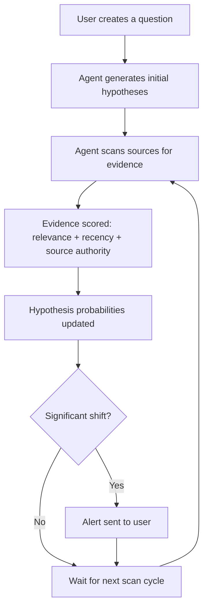

# Hypothesis-tracking agent design: how Watching Agents models uncertainty

*Posted 2026-06-30*

Most prediction tools ask you to pick a number. "What's the probability that X happens?" You guess, you move on, the number sits there until you remember to update it. [Watching Agents](https://watchingagents.com) works differently. You describe a question about the future, and an AI agent watches it for you. It collects evidence, scores it, builds competing hypotheses, and pings you when something shifts.

This post walks through how we designed the core tracking loop: the data model, how evidence gets scored, and what triggers an alert.

## The tracking loop

Every agent in the system runs through the same cycle:

The key design decision was separating hypothesis generation from evidence collection. The agent does not start with a fixed probability. It starts with a question and generates two to five competing hypotheses, each one a plausible answer. Then it looks for evidence.

## Data model

Three core entities drive everything.

**Hypothesis.** A short statement that could be true or false, tied to a parent question. Each hypothesis has a probability score (0 to 1) and a confidence score (also 0 to 1). Probability says "how likely is this outcome." Confidence says "how much evidence do we actually have." A hypothesis can be at 0.8 probability with 0.2 confidence if the agent has a strong prior but almost no data yet.

**Evidence.** A piece of information the agent found while scanning. Every evidence record stores: the source URL, a timestamp, a one-sentence summary the agent wrote, a relevance score (does this actually relate to the hypothesis?), and a direction (supports, weakens, or is neutral toward each hypothesis it touches). One piece of evidence can affect multiple hypotheses in different directions.

**Alert trigger.** A rule that fires when something meaningful changes. We started with three trigger types: probability crossing a threshold (e.g. a hypothesis goes above 0.7 for the first time), probability reversal (the leading hypothesis gets overtaken), and evidence velocity spike (the agent finds significantly more evidence than usual in a scan window, which often means something just happened).

## Evidence scoring

Scoring evidence turned out to be the hardest part. Raw web pages contain a lot of noise, and the agent needs to decide quickly whether a piece of information actually matters.

We settled on three axes, each scored 0 to 1:

**Relevance** measures how directly the evidence relates to the hypothesis. A news article mentioning the exact company in your question scores higher than a sector overview. We compute this using embedding similarity between the evidence summary and the hypothesis text, then apply a threshold to filter out weak matches.

**Recency** applies a time decay. Evidence from today weighs more than evidence from last month. The decay function is exponential with a half-life that depends on the question's time horizon. Short-term questions (weeks) decay faster than long-term ones (years).

**Source authority** is the simplest one. We maintain a ranked list of source types: primary sources (official announcements, SEC filings, peer-reviewed papers) score highest, major news outlets score mid-range, blog posts and social media score lowest. No source gets filtered out entirely, because sometimes a tweet breaks news before Reuters picks it up. But the scores weight the final calculation.

The combined evidence score is a weighted product of all three. When new evidence arrives, the agent recalculates hypothesis probabilities using a Bayesian update step where the evidence score determines how much the posterior shifts from the prior.

## What triggers an alert

We were cautious here. Too many alerts and people stop reading them. Too few and the product feels dead.

The three trigger types we shipped:

**Threshold crossing.** The user can set a probability level they care about. "Tell me if the probability goes above 70%." Simple, easy to understand, and the one most users actually configure.

**Reversal.** If Hypothesis A was leading at 0.6 and Hypothesis B overtakes it, that is almost always interesting. This trigger fires without any user configuration because a reversal is inherently newsworthy.

**Evidence spike.** If the agent normally finds one or two relevant pieces of evidence per scan and suddenly finds eight, something happened in the world. This trigger catches breaking developments before they have fully affected the probability scores.

Each alert includes the evidence that caused it, so users can read the source material themselves. We found early on that sending a probability number without context felt arbitrary. People wanted to see why the number moved, not just that it moved.

## What we got wrong early on

**Too many hypotheses.** Our first version generated up to ten hypotheses per question. Most of them overlapped or were edge cases nobody cared about. Capping at five and merging similar ones made the interface readable and the probability distribution meaningful.

**Static scan intervals.** We initially scanned every source on the same schedule. Now the agent adjusts its scan frequency based on evidence velocity. A question that is getting a lot of new evidence gets scanned more often. A question where nothing has changed in two weeks gets scanned less.

**Treating all evidence equally before scoring.** The first version dumped everything into the scoring pipeline. Adding a pre-filter that checks basic relevance before running the full scoring pipeline cut our processing cost by about 40% with no measurable accuracy loss.

## Where this stands

The tracking loop has been running in production on [Watching Agents](https://watchingagents.com) for several weeks now. Public agents (anyone can create one, and the results page is indexable) are generating the data we need to keep refining the scoring model. Confidence scores still need calibration work. Our current plan is to track how often a high-confidence, high-probability hypothesis actually resolves correctly and use that to tune the decay functions and source authority weights.

The architecture is intentionally simple. Three entities, one scan loop, three alert types. Complexity will come from the scoring model getting better, not from adding more moving parts.
