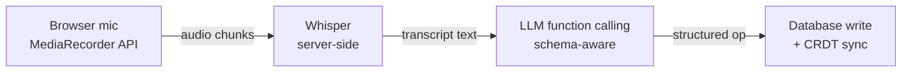
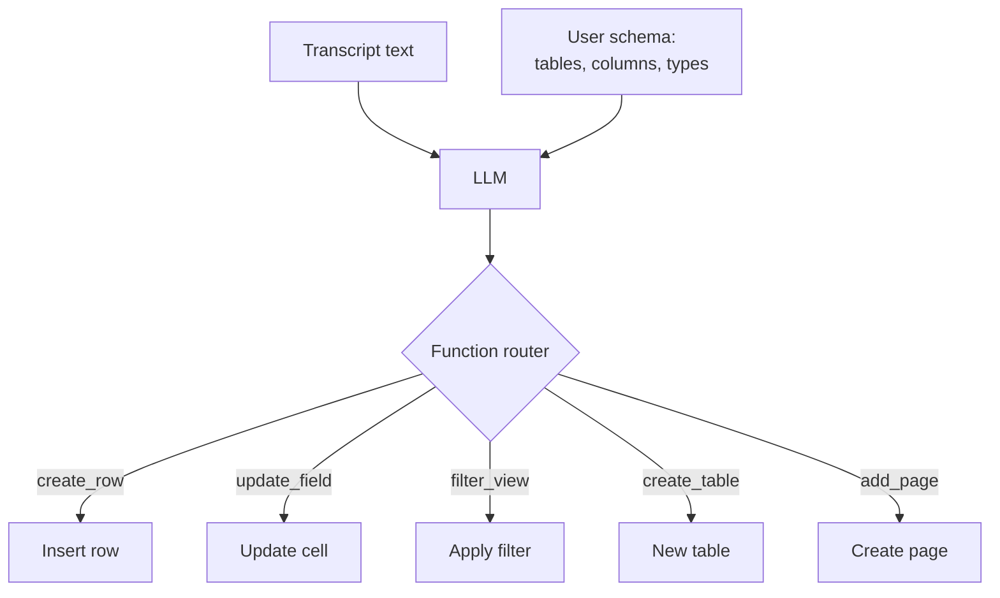
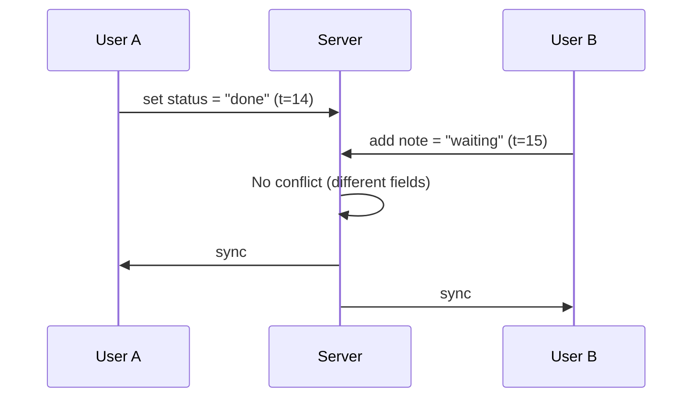

# Voice Tables architecture: how we turn spoken input into structured data

*Posted 2026-06-28*

We shipped the [Voice Tables](https://voicetables.com) beta a few weeks ago and wrote a [dev journal](https://github.com/jakubinithouse/inithousebuiltinpublic/blob/main/posts/voice-tables-beta-journal.md) covering the week-by-week progress. This post goes deeper into the architecture itself. How does a sentence like "add a row, name Sarah, amount 320" become a structured database entry?

The short version: browser audio capture, Whisper transcription, LLM function calling against the user's schema, then a write to the database layer. Four stages, each with its own failure modes. Here's the full pipeline.

## The pipeline

The voice-to-data flow has four stages. Each one transforms the signal into something more structured than what came in.

**Stage 1: Audio capture.** The browser's MediaRecorder API captures audio in chunks. We stream chunks to the server rather than waiting for the user to stop talking. Chunked streaming adds about 200ms of overhead compared to a single upload, but it lets us start Whisper processing before the user finishes speaking. On average, this shaves 400ms off the total round-trip. Net gain: roughly 200ms.

**Stage 2: Whisper transcription.** Audio chunks arrive at the server and get batched. Batching matters because Whisper's throughput scales better with slightly larger inputs. Our current batch window is 300ms. Median transcription time sits at around 900ms for a typical command (5-15 words). We tested a smaller distilled Whisper model that runs 300ms faster, but accuracy dropped from 94% to 89% on our test corpus. We're still on the full model. That 5% accuracy gap translates to roughly 1 in 20 commands needing a correction, which is too high for data entry.

**Stage 3: LLM function calling.** This is where the interesting part happens. The transcript ("add a row, name Sarah, amount 320") arrives as plain text. The LLM receives it along with the user's current workspace schema: table names, column names, column types, existing views. We define a set of callable functions that map to workspace operations.

The function schema mirrors the data model. When someone says "filter invoices where status is unpaid," the LLM maps that to `filter_view(table="invoices", column="status", operator="equals", value="unpaid")`. No fine-tuned classifier, no intent taxonomy. The schema IS the intent space.

We chose this over classification for one reason: the schema changes per user. A sales rep has "Leads" and "Deals" tables. A craftsman has "Jobs" and "Materials." A fine-tuned classifier would need retraining every time someone adds a column. Function calling adapts at inference time because the schema is part of the prompt context.

Current accuracy on structured commands: 92%. On freeform dictation (pages, chat), it drops to about 78% because there's no schema to anchor against.

**Stage 4: Database write and sync.** The structured operation hits the database layer. For single-user scenarios this is straightforward. For real-time collaboration it gets tricky.

## Real-time collab: CRDTs for concurrent voice commands

Two people can speak commands at the same time. Person A says "set status to done" while Person B says "add a note: waiting for client." Both operations need to land without one overwriting the other.

We use CRDTs (conflict-free replicated data types) for the sync layer. Each operation gets a logical timestamp. Field-level granularity means two people can edit different columns of the same row simultaneously without conflict. Same-field concurrent edits use last-writer-wins with the logical clock as tiebreaker.

The CRDT approach adds about 50ms of overhead per write compared to a naive last-write-wins system. For a voice-first tool where the bottleneck is Whisper at 900ms, 50ms is invisible.

## Offline: buffered voice, immediate typed input

Offline support was the trickiest part to get right. Typed input works fully offline through IndexedDB. You can create rows, update fields, filter views. Everything syncs when you reconnect.

Voice is harder. Whisper runs server-side, so there's no transcription without a connection. Our approach: buffer the audio locally and transcribe on reconnect. The sync queue processes buffered audio in order, applies the resulting operations, then reconciles with any changes that happened on other devices while you were offline.

It's not perfect. If you record 30 voice commands offline and reconnect, there's a burst of operations that can take 20-30 seconds to process. We show a progress indicator so it doesn't feel broken, but the delay is real. For most use cases (field worker doing a site inspection, logging 5-10 entries without signal), it works fine.

## Latency breakdown

End-to-end median for a voice command to appear as structured data: 2.4 seconds. Here's where the time goes:

| Stage | Median | Notes |
|---|---|---|
| Audio capture + chunking | 800ms | Includes streaming overhead |
| Whisper transcription | 900ms | Full model, 300ms batch window |
| LLM function calling | 500ms | Varies with schema complexity |
| Database write + sync | 200ms | Includes CRDT overhead |

The Whisper leg is the bottleneck. We're exploring two paths to reduce it: a distilled model (faster but less accurate) and speculative partial transcription (start function calling on partial transcript, discard if the full transcript changes the intent). Neither is in production yet.

## Open questions

We're still working through multi-language schema resolution. A user in Prague creates Czech column headers ("Jméno," "Částka") and speaks Czech commands. Whisper handles the transcription fine. But the LLM function calling layer currently expects the column names in the prompt context, and mixing languages in the schema doubles the error rate. We've tried a normalization step (translate column names to English before function calling, map back after), which helps, but adds 150ms and occasionally mistranslates domain-specific terms.

If you've dealt with mixed-language schemas in voice or NLP pipelines, we'd like to hear about it. Open an issue in this repo or try the beta at [voicetables.com](https://voicetables.com).

Built at [Inithouse](https://inithouse.com), a studio running parallel product experiments.
